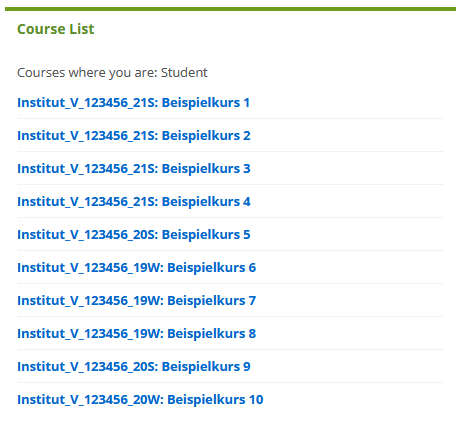
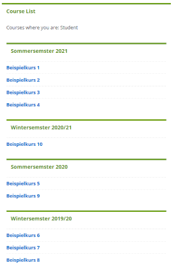

# BB Kurse FU

Browser Erweiterung, um das Blackboard der FU Berlin (lms.fu-berlin.de) aufzupeppen und übersichtlicher zu gestalten.

## Funktionen
* Kursliste automatisch nach Semestern sortieren
    * Zusätzlich nach Fachbereichen sortieren
    * Kurs ID weiterhin anzeigen
    * Link zum VV anzeigen (nur aktuell für Kurse des laufenden Semesters)
* "Alles herunterladen" Knopf im Reiter __Kursmaterial__ (lädt alle Dateien im Ordner herunter)

Alle Funktionen sind ein-/ausschaltbar in den Erweiterungseinstellungen (Browser Einstellungen > Erweiterungen > BB Kurse FU > Optionen). Diese sind auch erreichbar, wenn man auf einer BB Kurseite ist und dann in der Browserleiste auf das Icon des Add-ons klickt.

## Screenshots
| *Kursliste vorher* | *Kursliste nacher* |
| :-: | :-:|

## Wichtig

Damit das Sortieren funktioniert muss die Kurs-ID (Course ID) angezeigt werden. Das kann [hier](https://lms.fu-berlin.de/webapps/portal/execute/tabs/tabAction?tab_tab_group_id=_2_1&forwardUrl=edit_module%2F_183_1%2Fbbcourseorg%3Fcmd%3Dedit&recallUrl=) eingestellt werden
